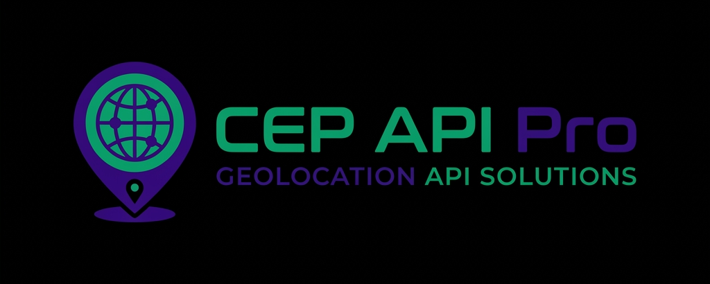

# 🌍 CEP API Pro



## Hub Global de Busca de Endereços


[](RELEASE_NOTES_v2.0.0.md)
[](LICENSE)

[](CODE_OF_CONDUCT.md)

*Uma API assíncrona, resiliente e com interface web premium para busca de códigos postais do Brasil e de 197 países ao redor do mundo.*

---

## 📋 Índice

- [Visão Geral](#-visão-geral)
- [Arquitetura](#-arquitetura)
- [Funcionalidades](#-funcionalidades)
- [Endpoints](#-endpoints)
- [Provedores de Dados](#-provedores-de-dados)
- [Histórico de Versões](#-histórico-de-versões)
- [Autor](#-autor)

---

## 🎯 Visão Geral

A **CEP API Pro** é um hub inteligente de geolocalização postal que unifica múltiplos provedores de dados em uma interface única, consistente e de alta performance. Ela roteia, normaliza e entrega respostas de endereços em **JSON** ou **XML** — seja para um CEP de São Paulo ou um Postal Code de Tóquio.

---

## 🏗 Arquitetura

O sistema opera em duas camadas complementares:

| Camada | Tecnologia | Responsabilidade |
| --- | --- | --- |
| **Backend** | FastAPI + HTTPX + Redis | Roteamento, fallback, resiliência (Circuit Breaker) e cache |
| **Frontend Web** | HTML5 + CSS3 + Vanilla JS | Interface premium PWA e internacionalização |

### Motor de Fallback Duplo

```text
Requisição do Usuário
        │
        ▼
  [Provedor Primário]
   Zippopotam.us / ViaCEP
        │
    Sucesso? ──── ✅ ──► Retorna resposta normalizada
        │
        ❌
        │
        ▼
  [Provedor Secundário]
  OpenStreetMap Nominatim
        │
    Sucesso? ──── ✅ ──► Traduz para alfabeto romano e retorna
        │
        ❌
        │
        ▼
   Erro 404 com mensagem clara para o usuário
```

---

## 🚀 Funcionalidades

### Infraestrutura e Segurança (Novo na v2.0)

- **Circuit Breaker Pattern**: Utilização da biblioteca `pybreaker` para identificar falhas repetidas em provedores e poupar chamadas em massa, redirecionando o tráfego para fallbacks ou respostas instantâneas de erro.
- **Camada de Cache (Redis & TTLCache)**:
  - No Backend: O Redis (via `redis.asyncio`) absorve chamadas repetidas, salvando requisições idênticas para a resposta na casa dos milissegundos.
- **Segurança (API Key)**: Todos os endpoints estão protegidos por um Middleware `X-API-KEY`. O sistema utiliza a variável de ambiente `CEP_API_KEY` para validação. Se não definida, utiliza um valor padrão para testes. O Frontend Web injeta esse cabeçalho automaticamente nas requisições.
- **Log Rotativo**: Logs consistentes salvos em `cep_api.log` diariamente, guardando um histórico local por 30 dias sob fuso horário oficial do Brasil (BRT).

### Backend

- **Requisições 100% Assíncronas**: Todo o stack de HTTP utiliza `httpx` com `async/await`, garantindo throughput máximo no Event Loop do FastAPI sem bloqueios.
- **Fallback Internacional Inteligente**: Se o `Zippopotam.us` não possui dados do país requisitado, o sistema aciona silenciosamente o `OpenStreetMap Nominatim`, converte o resultado para o mesmo contrato de resposta e entrega sem interrupção.
- **Tradução Automática de Caracteres**: Resultados em alfabetos não-latinos (japonês, árabe, chinês, coreano etc.) são convertidos automaticamente para caracteres ocidentais via o cabeçalho `Accept-Language`.
- **Rigor Fiscal para o Brasil**: A rota nacional utiliza exclusivamente o **ViaCEP** — espelho oficial da base dos Correios — garantindo que apenas CEPs ativos e válidos sejam retornados, requisito essencial para emissão de Notas Fiscais.
- **Sanitização Regional de Inputs**: Lógica embutida no frontend para tratar prefixos e formatos específicos por país antes de enviar ao backend.

| País | Regra Aplicada | Exemplo |
| --- | --- | --- |
|  Reino Unido | Mantém apenas o *Outward Code* | `M16 0RA` → `M16` |
|  Canadá | Primeiros 3 caracteres | `A1A 1A1` → `A1A` |
|  Holanda | Primeiros 4 dígitos | `1012 AB` → `1012` |
|  Taiwan | Prefixo regional de 3 dígitos | `115008` → `115` |
|  Hong Kong | Placeholder logístico `999077` | Interceptado e mapeado |

### Frontend Web

- **Internacionalização (i18n)**: Seletor de idioma nativo e customizado (PT, EN, ES) com ícones do FlagCDN adaptando toda a interface perfeitamente para clientes e redes de hotelaria globais.
- **Progressive Web App (PWA)**: Instalação nativa em Desktop/Mobile com Service Workers e ícone dedicado (`app_icon.png`).

- **Identidade Visual**: Logo de alta resolução integrado fluidamente via CSS Blend Modes e Dark Mode nativo.
- **Dropdown customizado** com bandeiras de 197 países via FlagCDN.
- **Copiar para Área de Transferência** com feedback visual animado.

---

## 📖 Endpoints

### Busca Brasil

```http
GET /api/cep/{cep}
```

| Parâmetro | Tipo | Descrição |
| --- | --- | --- |
| `cep` | `string` | 8 dígitos numéricos (com ou sem hífen) |
| `?formato` | `query` (opcional) | `json` (padrão) ou `xml` |

**Exemplo de resposta (JSON):**

```json
{
  "cep": "01001-000",
  "logradouro": "Praça da Sé",
  "bairro": "Sé",
  "localidade": "São Paulo",
  "uf": "SP"
}
```

> ⚠️ CEPs desativados pelos Correios retornam `404` com mensagem orientativa. Isso é intencional para garantir validade fiscal.

### Busca Internacional

```http
GET /api/postal/{country}/{postal}
```

| Parâmetro | Tipo | Descrição |
| --- | --- | --- |
| `country` | `string` | Código ISO Alpha-2 (ex: `us`, `jp`, `gb`) |
| `postal` | `string` | Código postal do respectivo país |
| `?formato` | `query` (opcional) | `json` (padrão) ou `xml` |

**Exemplo de resposta (JSON):**

```json
{
  "post code": "10001",
  "country": "United States",
  "country abbreviation": "US",
  "places": [
    {
      "place name": "New York City",
      "state": "New York",
      "latitude": "40.7484",
      "longitude": "-73.9967"
    }
  ]
}
```

---

## 🔌 Provedores de Dados

| Provedor | Cobertura | Uso |
| --- | --- | --- |
| [ViaCEP](https://viacep.com.br) | Brasil | Primário — Brasil |
| [Zippopotam.us](http://api.zippopotam.us) | ~60 países | Primário — Internacional |
| [OpenStreetMap Nominatim](https://nominatim.openstreetmap.org) | Mundial | Fallback — Internacional |

---

## 📜 Histórico de Versões

| Versão | Data | Descrição |
| :--- | :--- | :--- |
| **v2.0.0** | Mai/2026 | Arquitetura resiliente (Circuit Breaker, Redis), Segurança X-API-KEY e i18n. |
| **v1.1.0** | Mai/2026 | Suporte a PWA, refatoração de Layout (CSS Grid/Flexbox) e Identidade Visual (Novo Logo). |
| **v1.0.0** | Mai/2026 | Lançamento oficial — Backend assíncrono, motor de fallback e interface Dark Mode. |

> Veja as notas completas da versão atual em [RELEASE_NOTES_v2.0.0.md](RELEASE_NOTES_v2.0.0.md).

---

## 👤 Autor

### Caique Novaes

> *Simplificando a geolocalização global, um código postal de cada vez.*

[](https://github.com/caiquenovaes1994)
[](mailto:caiquenovaes1994@gmail.com)
